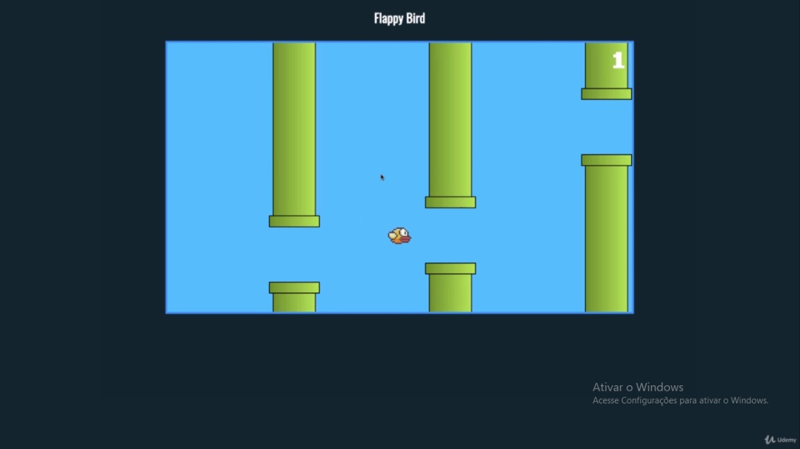

# Flappy Bird Project

Projeto construído durante o curso sobre Web

---

## Sumary 📔

- [Flappy Bird Project](#flappy-bird-project)
  - [Sumary 📔](#sumary-)
  - [About it](#about-it)
  - [Technologies](#technologies)

---

## About it

This project was basically developed during the study of the modern Web Course. It is basically a replica of Flappy Bird, an old mobile game 📱🐦. The idea of the project is basically just training dom events, about parentship of html elements and somethings about POO, it's not literally POO but it's almost. 

---

## Technologies

- HTML
- CSS3
- Javascript

